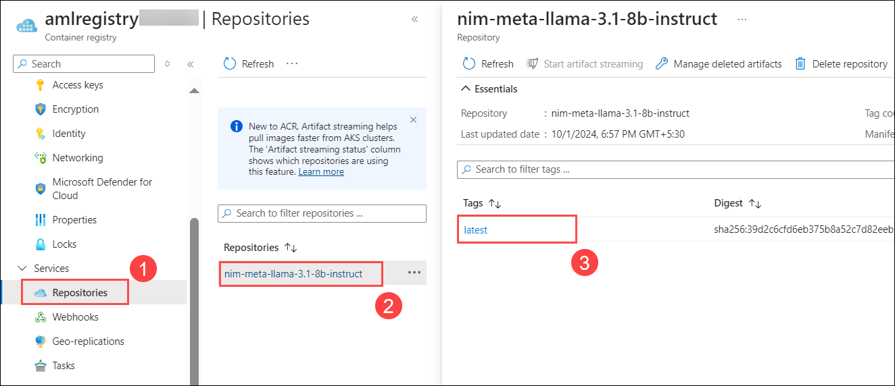
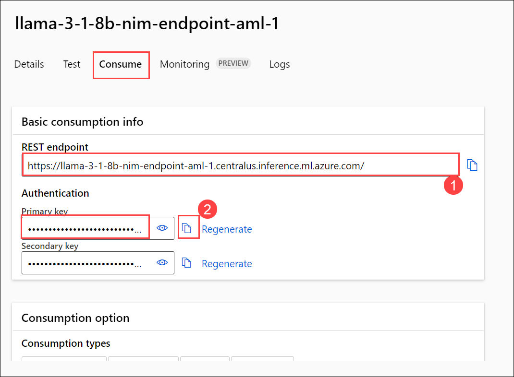

# Challenge 01: Deploy NVIDIA NIM on Azure

### Estimated Time: 60 minutes

## Introduction

This lab guides participants through deploying NVIDIA NeMo Inference Manager (NIM) on Azure, which facilitates rapid development and deployment of sophisticated AI models for various applications. NVIDIA NIM is a model deployment and management solution that enables efficient utilization of NVIDIA GPUs for AI model inference. This deployment involves using Azure's powerful cloud infrastructure to host NIM containers, which simplifies the integration of AI models into production environments by managing model lifecycle, deployment, and scaling in Azure Machine Learning (AML) services.

Participants will begin by creating an NVIDIA account to generate an API key, essential for accessing NVIDIA’s NGC resources, such as container images for NeMo models. Then, the lab covers setting up Azure Container Registry (ACR) for storing these images, configuring Git Bash to interact with Azure, and updating relevant configuration files within Visual Studio Code. After this setup, participants will deploy the NIM container through Azure Machine Learning, which will handle the GPU-based model deployment and expose it through a managed online endpoint.

## Solution Guide

### Task 1: Generate NGC API KEY

The NVIDIA API key is a unique identifier used to authenticate requests to NVIDIA's APIs, such as the NGC (NVIDIA GPU Cloud) services. This key allows developers to access various resources, including pre-trained models, GPU-accelerated software, and container images. Obtaining an API key typically involves creating an account on NVIDIA's developer portal and generating the key within the account settings. It is important to keep this key secure, as it grants access to your NVIDIA resources and can be used for billing purposes.

1. Please [Click Here](https://nvdam.widen.net/s/tvgjgxrspd/create-build-account-and-api-key) and follow the instructions to generate an NVIDIA API Key.

### Task 2: Setup Git Bash Environment

In this task you are going to setup the **Git Bash** to perform the further tasks. Where you are going to download and install essential tools like jq, Azure CLI, and the ML extension, then verify the setup. Finally, clone the deployment repo and navigate to the Azure ML deployment directory.

1. In the **LabVM**, click on the Start menu and search for **git bash** **(1)**. Once you find it, right-click on **Git Bash** **(2)** and select **Run as administrator** **(3)** to launch Git Bash with elevated privileges.

   

1. Run the following command. This command downloads the latest version of jq, a lightweight and flexible command-line JSON processor, and saves it as an executable file named `jq.exe` in the `/usr/bin/` directory, making it accessible for command-line use.

   ```
   curl -L -o /usr/bin/jq.exe https://github.com/stedolan/jq/releases/latest/download/jq-win64.exe
   ```

1. Install the az CLI by navigating to the below link:

      ```
      cmd.exe /c "powershell -Command \"$ProgressPreference = 'SilentlyContinue'; Invoke-WebRequest -Uri https://azcliprod.blob.core.windows.net/msi/azure-cli-2.51.0.msi -OutFile AzureCLI.msi; Start-Process msiexec.exe -Wait -ArgumentList '/I AzureCLI.msi /quiet'; Remove-Item AzureCLI.msi\""
      ```

Detailed instructions can be found [here](https://github.com/NVIDIA/nim-deploy/tree/main/cloud-service-providers/azure/azureml/cli).

### Task 3: Visual Studio config.sh file update

In this task you are going to open the cloned cli folder in VS Code and update the config.sh file with your Azure details like subscription ID, workspace name, and NGC API key and save the file.

1. Start **Visual Studio Code** by launching it from your desktop.

   

1. Go to the **Explorer(1)** panel in the upper left corner, click on **Open Folder(2)**,  select **cli folder(3)** from the location where you have cloned the repo in previous step `Desktop/cloud-service-providers/azure/azureml/cli` , and then click on **Select Folder(4)** to open it in Visual Studio Code.

   ```
   c:\Users\demouser\Desktop\nim-deploy\cloud-service-providers\azure\azureml\cli
   ```

   

1. Select **Yes, I trust the authors**.

   

1. Open the `config.sh` file and update the values as needed. You can refer to the `example_config.sh` file for guidance on the appropriate configurations and settings.

   | Setting | Action |
   | -- | -- |
   | **location** | **<inject key="StandardNCADSA100v4Family Quota" enableCopy="false"/></inject>**|
   | **ngc_api_key** | Provide the NGC key  |

   > **Note:**  Select only one **location** from the list. All required values have been preconfigured to reduce setup duration; please update only the **location** and **NGC API** key as needed.

   

   

1. Press **Ctrl + S** to save the changes you made to the file.

### Task 4: Create AzureML Deployment of the NIM Container

In this task you will log in to Azure via Git Bash by sourcing the updated config.sh file and running the az login and az account set commands using your username, password, and subscription ID. 

### Login to Azure with Your Credentials

1. Switch back to the **Git Bash** terminal.

1. Update your login credentials (**Username** and **Password**) and set the **subscription_id** for your subscription.
   
   - **Subscription Id:** - <inject key="SubscriptionID"></inject>
   - **Username:** <inject key="AzureAdUserEmail"></inject>
   - **Password:** <inject key="AzureAdUserPassword"></inject>

      ```
      source config.sh
      ```

        > **Note** : If you get any error message related to path use the following command

      ```
      cd /c/Users/demouser/Desktop/nim-deploy/cloud-service-providers/azure/azureml/cli
      source config.sh
      ```

      ```
      az login --user <inject key="AzureAdUserEmail" enableCopy="false"></inject> --password <inject key="AzureAdUserPassword" enableCopy="false"></inject>
      az account set -s <inject key="SubscriptionID" enableCopy="false"></inject>
      ```
      > **Note:** If you encounter any issues during login, you can execute the following command.

      ```
      az account clear
      az config set core.enable_broker_on_windows=false
      az login --user <inject key="AzureAdUserEmail" enableCopy="false"></inject> --password <inject key="AzureAdUserPassword" enableCopy="false"></inject>
      az account set -s <inject key="SubscriptionID" enableCopy="false"></inject>
      ```

 1. If it prompts an Azure login window, please select your credentials to log in. 

###  Task 5: Setup AzureML Workspace

In this task you will the run command to create a new AzureML workspace with the required role.

1. Execute the following command to create a new AzureML workspace with the "Azure ML Secrets Reader" role assignment.

   ```cmd
   ./1_set_credentials.sh --create_new_workspace
   ```

   >**Note :** If you see an `ERROR: 'ml' is misspelled or not recognized by the system.` Run the below commands to remove, install and verify ml extension.

   ```
   az extension remove -n ml
   ```

   ```
   az extension add -n ml
   ```

   ```
   az ml -h
   ```

   > **Note :** Rerun the command.

1. You can find the newly created worksapce in Azure Portal

   

###  Task 6: Store NGC API Key for Use in the AzureML Deployment

In this you will store the NGC API Key securely in AzureML for model deployment.Run the following script to save the key as a workspace connection credential and verify access:

1. To Store NGC API Key for Use in the AzureML Deployment.You have two options for storing the NGC API Key:

   >**Note :** The NGC API Key needs to be stored within Azure so the AzureML workspace can access it during deployment. The API key is required to pull the correct model from the NGC model  catalog. The key can be provided as a workspace connection to the AzureML workspace.
   
   **Store the Key as a Workspace Connection:**
   Store the NGC API Key as a custom credential using a workspace connection.

   This script stores the NGC API Key as a workspace connection credential and verifies if the provided workspace can access it.

   Run the following script to configure this and verify the connection

   ```cmd
   ./2_provide_ngc_connection.sh
   ```

###  Task 7: Save NIM Container in Your Container Registry

Pull the NIM Docker container for the model specified in the `config.sh` file. Create another Docker container wrapped around the NIM container for deployment in AzureML and push this new container to an Azure container registry that can be accessed by your AzureML endpoint. All required commands are provided in the `3_save_nim_container.sh` script.

1. Run the following command to **save the NIM container in your container registry**.

   ```cmd
   ./3_save_nim_container.sh
   ```

   > **Note:** To save setup time, we have pre-pulled the `llama3-8b-instruct:latest` image. You do not need to pull it manually.
   > **Note:** This action will approximately take around 20-25 Minutes. 

1. Navigate to your container registry (**amlregistry<inject key="DeploymentID" enableCopy="false"/>**) , Under the service click on the **Respositiories(1)** select your **nim-meta-llama-3.1-8b-instruct(2)** regiestry, here you will find your image is pushed with the tag name **latest(3)**.

   

###  Task 8: Create Managed Online Endpoint

In this task you will create a secure, scalable endpoint for your AI model using AzureML's managed online deployment. It ensures your app can interact with the model in real time via REST APIs.

1. Run the following command to **Create Managed Online Endpoint**.

   ```cmd
   ./4_create_endpoint.sh
   ```

   >**Note :** This command creates an endpoint with the name provided in the config.sh file. If you see an `ERROR: 'ml' is misspelled or not recognized by the system.` Run the below commands to remove, install and verify ml extension.

   ```
   az extension remove -n ml
   ```

   ```
   az extension add -n ml
   ```

   ```
   az ml -h
   ```

   >**Note :** Rerun the command to create endpoint.

###  Task 9: Role Assignment

Assign the AcrPull role to the Machine Learning Online Endpoint’s managed identity via Access control (IAM) in the amlregistry container registry.
Choose the role **AcrPull**, then add the endpoint identity under Managed identity.

1. Go to **amlregistry<inject key="DeploymentID" enableCopy="false"/>** container regiestry first. navigate to **Access control (IAM) (1)**. Click on **+ Add (2)** and choose **Add role assignment(3)**. This allows you to assign specific roles to users, groups, or applications, controlling their permissions to manage resources associated with the app service.

   

1. In the **Add role assignment** page, under the Role tab, choose **Job function roles(1)**. Search and select **AcrPull(2)** within this category select the **ArcPull(3)**, and then click **Next(4)** to proceed.

   

1. Next, under the Members tab, select **Managed identity(1)** for Assign access to, and then click on **+ Select members(2)**. Further, under the **Select managed identities** on the right, choose **Machine learning online endpoint(3)** for **Managed identity**. Finally, under **Selected members**, choose the **llama3-1-8b-nim-endpoint-aml-1(4)**, of choice and then continue by clicking on **Select(5)** and **Next(6)**.

   

1. Click on **Review + assign**.

### Task 10: Create AzureML Deployment of the NIM Container

Here you will be creating an AzureML deployment with the NIM container obtained from the provided Azure container registry.

1. Run the following command to **Create AzureML deployment of the NIM container**.

   ```cmd
   ./5_create_deployment.sh
   ```

   >**Note:** This action will approximately take around 20-25 Minutes.

### Task 11: Verify Your Connection

In this task you are going to launch Azure ML Studio from the ml-workspace, navigate to Endpoints > Your Endpoint > Consume, and copy the REST endpoint and Primary key. Update test_chat_completions.sh in VS Code with the correct endpoint and deployment name, then run command to verify the chat completion setup.

1. Return to the **Azure Portal**.

2. Open the **ml-workspace** and click on **Launch studio**.

   

3. This will take you to **Azure AI | Machine Learning Studio**. From the left-hand menu, select **Endpoints** and choose your endpoint.

   

4. Go to the **Consume** tab, then copy the **REST endpoint(1)** and **Primary key(2)**.

   

5. In VS Code, open the **`test_chat_completions.sh`** file. Replace the following headers `<your-azureml-endpoint>`, `<your-azureml-endpoint-token>`, and `<deployment-name>` with the appropriate values. Ensure the **deployment-name** matches the one in your `config.sh` file and save the file.

   >**Note:** Ensure to add **/v1/chat/completions** towards the end of the endpoint.

6. Once you have updated all the headers, the code should look similar to the following:

   ```
   #!/bin/bash
   curl -X 'POST' \
   '<your-azureml-endpoint-token>/v1/chat/completions' \
   -H 'accept: application/json' \
   -H 'azureml-model-deployment: llama3-1-8b-nim-dep<inject key="DeploymentID" enableCopy="false"/>' \
   -H 'Authorization: Bearer '<your-azureml-key>' \
   -H 'Content-Type: application/json' \
   -d '{
   "messages": [
    {
      "content": "You are a polite and respectful chatbot helping people plan a vacation.",
      "role": "system"
    },
    {
      "content": "What should I do for a 4 day vacation in Spain?",
      "role": "user"
    }
   ],
   "model": "meta/llama3-8b-instruct",
   "max_tokens": 500,
   "top_p": 1,
   "n": 1,
   "stream": false,
   "stop": "\n",
   "frequency_penalty": 0.0
    }'
   
   ```

1. Run the following command to Verify Connection.

   ```
   ./test_chat_completions.sh
   ```

1. You will see the output similar to the below screenshot.

     

Now, click on **Next** from the lower right corner to move on to the next page.
 
    

### Happy Learning!!

