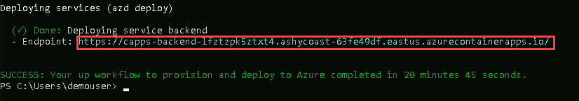

# Desafio 03:  Implante um aplicativo de bate-papo com tecnologia de IA 

### Tempo Estimado: 150 minutos

### Introdução:

Neste desafio, você implantará uma aplicação de chat com IA desenvolvida especificamente para a Contoso Electronics. Construída com React no frontend e Python no backend, a aplicação oferece recursos avançados, incluindo interfaces de chat e de Perguntas e Respostas (Q&A), todos potencializados por capacidades de IA. Esta é uma excelente oportunidade para explorar a integração do Serviço OpenAI do Azure com o modelo GPT-3.5 Turbo, além do Azure Cognitive Search, garantindo indexação e recuperação eficientes de dados.

Mais do que uma simples interface de chat, esta aplicação de exemplo demonstra o padrão de Geração Aumentada por Recuperação (RAG), proporcionando uma experiência rica, semelhante à do ChatGPT, aplicada aos dados da Contoso. Entre seus recursos estão a avaliação da confiabilidade das respostas com citações, rastreamento da origem do conteúdo, preparação de dados, construção de prompts e orquestração da interação entre o modelo ChatGPT e o Cognitive Search. A interface do usuário permite ajustes e experimentações, além de oferecer monitoramento opcional de desempenho por meio do Application Insights.

Sua missão neste desafio é implantar essa solução de chat completa, permitindo que a Contoso avalie suas capacidades e a integre em seu ambiente corporativo. O repositório inclui dados de amostra, oferecendo uma solução ponta a ponta pronta para uso. Essa aplicação é uma ferramenta valiosa para que os funcionários da Contoso consultem informações sobre benefícios, políticas internas, descrições de cargos e funções.

Você usará Bicep para provisionar a aplicação de chat.

A aplicação se integra de forma transparente com diversos serviços do Azure para fornecer uma experiência de usuário inteligente. A seguir, apresentamos uma visão geral de cada serviço utilizado:

- **Container Apps:** O Azure Container Apps implanta e escala aplicações em contêineres sem esforço, garantindo confiabilidade com escalonamento automático e integração com o Azure Monitor.
- **Application Insights:** Monitoriza proativamente o desempenho da aplicação, cuidando dos problemas antes que se tornem significativos.
- **Document Intelligence:** Usando IA, entende o conteúdo dos documentos carregados, tornando as informações do usuário mais perspicazes.
- **OpenAI do Azure:** Aprimora as capacidades da aplicação com compreensão e respostas em linguagem natural.
- **Painel Compartilhado:** Atua como um hub central para colaboração da equipe e compartilhamento de dados.
- **Regra de Alerta do Detector Inteligente:** Monitora a saúde da aplicação e notifica a equipe se surgirem problemas.
- **Serviço de Pesquisa:** Capacita os usuários com funcionalidades de pesquisa dinâmicas e eficientes dentro da aplicação.
- **Log Analytics Workspace:** Rastreia e analisa a atividade da aplicação, oferecendo insights valiosos e logs.
- **Plano de Serviço de Aplicativo:** Otimiza a alocação de recursos para um desempenho ideal da aplicação.
- **Conta de Armazenamento:** Armazena com segurança os dados que serão usados pelo serviço Azure AI Search para fornecer as entradas para a aplicação de chat.

Juntos, esses serviços criam uma aplicação de chat responsiva que combina recursos de IA, capacidades de monitoramento e gerenciamento eficiente de dados, proporcionando à Contoso uma experiência de usuário excepcional.

## Diagrama de arquitetura:


## Guia da Solução

## Pré-requisitos
   
1. Inicie o Powershell 7 +.
   
2. Certifique-se de executar `pwsh.exe` a partir de um terminal do PowerShell. Se isso falhar, é provável que você precise atualizar o PowerShell.

## Tarefa 1: Implementar a Applicação de chat com IA.

Nesta tarefa, você aprenderá o processo de provisionamento da Infraestrutura.

1. Usando a **LabVM**, na barra de pesquisa do Windows, digite **Powershell**, selecione **PowerShell 7-preview (x64)**  e, em seguida, **Executar como administrador**.

    

    >**Observação**: Se você não conseguir visualizar a prévia do Powershell 7. Execute os comandos abaixo, linha por linha, no Powershell ISE para instalar o **Powershell 7-preview.**

      ```
      $PSVersionTable.PSVersion
      
      # Defina a URL para o instalador MSI mais recente do PowerShell 7 Preview
      $url = "https://github.com/PowerShell/PowerShell/releases/download/v7.4.0-preview.2/PowerShell-7.4.0-preview.2-win-x64.msi"
      
      # Defina o local para salvar o arquivo MSI
      $output = "$env:TEMP\PowerShell-7-Preview.msi"
      
      # Baixe o instalador MSI
      Invoke-WebRequest -Uri $url -OutFile $output
      
      # Instale o PowerShell 7 Preview
      Start-Process msiexec.exe -ArgumentList "/i $output /quiet" -Wait
      ```

1. Execute o seguinte comando em **PowerShell** para instalar o Azure Developer CLI. Após a instalação, reabra o **PowerShell 7-preview (x64)**.

   ```
   powershell -ex AllSigned -c "Invoke-RestMethod 'https://aka.ms/install-azd.ps1' | Invoke-Expression"
   ```
   
1. Execute o seguinte comando para fazer login no Azure:

   ```
   azd auth login
   ```

   - Após executar o comando acima, uma aba do navegador será aberta e solicitará que você faça login no Azure. Selecione a conta do Azure na qual você já havia feito login ou, se solicitado, forneça seu nome de usuário e senha do Azure. Assim que a autenticação for concluída, você pode retornar ao PowerShell 7.
 
   - Retorne ao PowerShell 7, onde você deverá ver a mensagem **Logged in to Azure**.

     

1. Uma vez logado com sucesso, execute o comando abaixo para baixar o código do projeto:

   ```
   azd init -t azure-search-openai-demo
   ```
   >**Observação**: O comando acima inicializará um repositório git, eliminando a necessidade de cloná-lo posteriormente.

1. Quando solicitado com **Continue iniatializing an app in `C:\Users\demouser`**, digite **y / yes (1)**.

   

1. Se solicitado **What would you like to do with these files?**, escolha **Overwrite with versions from template**.

   

1. Digite um novo nome de ambiente:  **activategenai**

   >**Observação**: Isso criará uma nova pasta na pasta `.azure` e a definirá como o ambiente ativo para quaisquer chamadas futuras ao `azd`.

   

1. Verifique se a inicialização do novo projeto foi bem-sucedida.

   
   
1. Execute o comando abaixo para provisionar os recursos do Azure e implantar os recursos, incluindo a construção do índice de pesquisa com base nos arquivos encontrados na pasta `./data`.

   ```
   azd up
   ```
   >**Observação**: Caso receba a seguinte mensagem: **ERROR: not logged in, run azd auth login to login** selecione sua **Azure Account** novamente.

   >**Observação**: Tenha em mente que o processo de criação dos recursos e da aplicação pode levar até 30 minutos.

1. Forneça os seguintes dados quando solicitado:

   - Selecione uma assinatura do Azure para usar: Pressione **Enter** para escolher a **Subscription (1)** 
   - Selecione um local do Azure para usar: **Selecione qualquer local que você gostaria de usar (2)** 
   - Enter um valor para o parâmetro de infraestrutura 'documentIntelligenceResourceGroupLocation': **Selecione qualquer local que você gostaria de usar (3)** 
   - Insira um valor para o parâmetro de infraestrutura 'openAIResourceGroupLocation': **Selecione qualquer local que você gostaria de usar (4)**
     
      

      

1. Após a aplicação ter sido criada com sucesso, você verá uma URL no console. Copie e acesse a URL para interagir com a aplicação usando o seu navegador. A aplicação deve ter a seguinte aparência:

    
    
 
    >**Nota**: Pode levar até 30 minutos após você ver 'SUCCESS' para a aplicação estar totalmente criada. Se você vir uma tela de boas-vindas "Python Developer" ou uma página de erro, aguarde um pouco e atualize a página.

## Critérios de Sucesso:

- Provisionamento bem sucedido da aplicação de Chat.
- Verifique se os seguintes serviços estão provisionados com sucesso no Grupo de Recursos.
  - App Service
  - Document Intelligence
  - OpenAI do Azure
  - Painel Compartilhado
  - Regra de Alerta do Detector Inteligente
  - Serviço de Pesquisa
  - Log Analytics Workspace
  - Plano de Serviço de Aplicativo
  - Conta de Armazenamento
- Validar se os dados foram populados no contêiner de armazenamento chamado `content`.
- A aplicação de Chat deve estar acessível usando o Serviço de Aplicativo do Azure.

## Recursos Adicionais:

-  Consolte o repositório [Azure Search OpenAI demo](https://github.com/cmendible/azure-search-openai-demo) para informação adicional da arquitectura da aplicação.
-  [Azure copilot](https://learn.microsoft.com/en-us/azure/copilot/overview)

## Prossiga para o próximo Desafio clicando em **Próximo**>>.
