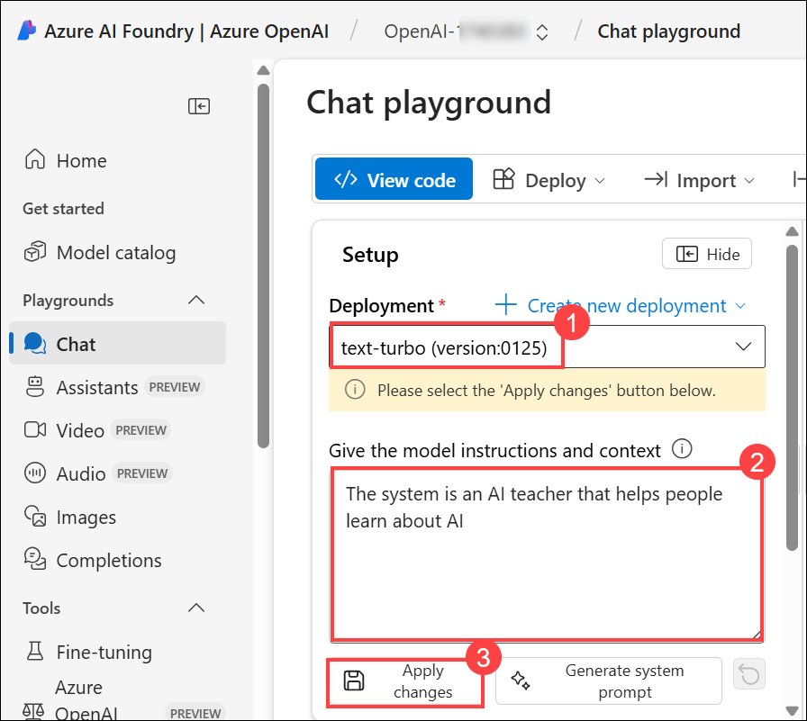
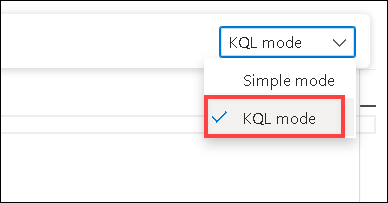
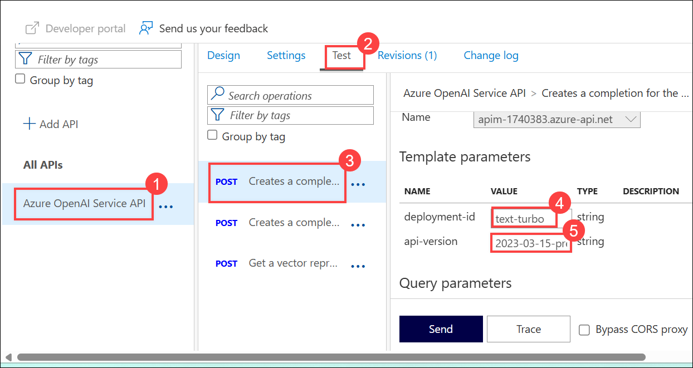
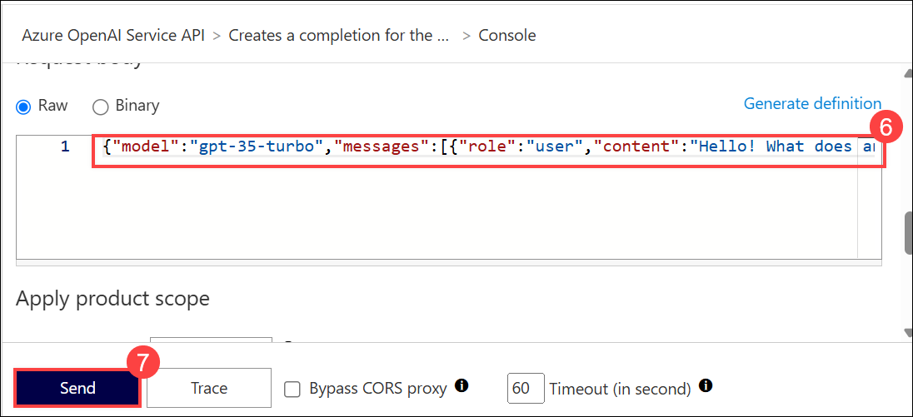

# Desafío 06: Implementar el Monitoreo y el Registro de Azure OpenAI utilizando el Servicio API Management

## Introducción

Explore la recopilación de datos de monitoreo, incluidos los registros de actividad y las métricas de plataforma. Configure Azure Monitor para la generación de registros, personalice el enrutamiento de datos con configuraciones de diagnóstico e inicie la recopilación de registros de recursos. Descubra las limitaciones del Área de Trabajo de Log Analytics en el registro de solicitudes de usuarios y respuestas de modelos. Mitigue esto integrando el Servicio Azure API Management para un registro completo en el entorno de Azure OpenAI.

# Guía de Soluciones

## Tarea 1: Monitorear el Servicio Azure OpenAI

Cuando sus aplicaciones y procesos empresariales cruciales dependen de los recursos de Azure, es esencial supervisar su disponibilidad, rendimiento y funcionamiento. Azure OpenAI proporciona paneles de control listos para usar para cada uno de sus recursos de Azure OpenAI. Para acceder a los paneles de monitoreo, navegue a la búsqueda del portal de Azure, seleccione OpenAI y elija uno de los recursos de OpenAI. En la Información general de los recursos de Azure OpenAI, puede acceder a los paneles de monitoreo haciendo clic en la pestaña **Monitor**.

   

Los paneles se agrupan en cuatro categorías: Solicitudes HTTP (HTTP Requests), Uso Basado en Tokens (Tokens-Based Usage), Uso de PTU (PTU Utilization) y Ajuste fino (Fine-tuning).
- **Solicitudes HTTP:** Paneles que monitorean los servicios con tecnología OpenAI en Azure y muestran el volumen de solicitudes, los tiempos de respuesta, los errores, la distribución geográfica y otras métricas. Ayudan a comprender las interacciones de los usuarios, a detectar problemas de rendimiento y a garantizar la confiabilidad del servicio.
- **Uso Basado en Tokens:** Esta categoría probablemente incluye paneles que supervisan el uso de tokens en Azure OpenAI. Los tokens son vitales para la autenticación, la autorización y el control de acceso. Ofrecen información sobre las tasas de creación, los patrones de uso y los tiempos de vida, detectando actividades sospechosas. La supervisión de tokens es fundamental para la seguridad de los recursos de IA.
- **Uso de PTU:** PTU hace referencia a las Unidades de Ajuste de Rendimiento en Azure OpenAI. Estos paneles monitorean y optimizan el uso de PTU, mostrando la asignación, las tendencias y las métricas de eficiencia, ofreciendo sugerencias de optimización. Es fundamental para aumentar el rendimiento y la asignación de recursos.
- **Ajuste fino:** Esta categoría incluye paneles que ofrecen herramientas e información para el ajuste de los servicios de Azure OpenAI. Incluyen métricas de rendimiento, configuraciones, resultados de experimentos y optimización de modelos de IA en Azure. Permiten tomar decisiones informadas para mejorar el rendimiento y la precisión de la IA.

### Tarea 1.1: Configurar los Ajustes de Diagnóstico

Azure OpenAI recopila los mismos tipos de datos de supervisión que otros recursos de Azure. Puede configurar Azure Monitor para generar datos en registros de actividad, registros de recursos, registros de máquinas virtuales y métricas de plataforma. Las métricas de plataforma y el registro de actividad de Azure Monitor se recopilan y almacenan automáticamente, y se pueden enrutar a otras ubicaciones mediante una configuración de diagnóstico. Los registros de recursos de Azure Monitor no se recopilan ni almacenan hasta que se crea una configuración de diagnóstico y un área de trabajo de Log Analytics.

1. En la página del Portal de Azure, en la caja de Búsqueda de recursos, servicios y documentos (G+/) en la parte superior del portal, ingrese **Azure OpenAI (1)**, y luego seleccione **Azure OpenAI(2)** en Servicios. 

    

1. En la hoja **AI Foundry | Azure OpenAI**, seleccione el **Servicio OpenAI** implementado anteriormente.

   

1. En la página de recursos de Azure OpenAI, en **Supervisión**, seleccione **Configuración de diagnóstico (1)** en el panel izquierdo. En la página Configuración de diagnóstico, seleccione **Agregar configuración de diagnóstico (2)**.

   

1. Para crear una nueva Configuración de diagnóstico, en la página **Configuración de diagnóstico**, configure los siguientes campos:
   - **Nombre de configuración de diagnóstico:** **OpenAI Diagnostic Setting (1)**
   - Seleccione **Enviar al área de trabajo de Log Analytics (2)** - marcado.
   - **Suscripción**: Predeterminada - Suscripción preasignada **(3)**
   - **Área de trabajo de Log Analytics:** Seleccione la única área de trabajo de Log Analytics precreada disponible en la suscripción **(4)**.
   - En **Registros** - Seleccione **allLogs (5)**.
   - En **Métricas**, seleccione **AllMetrics (6)**.
   - Para guardar la configuración, haga clic en **Guardar (7)**.

   

> Después de configurar correctamente los ajustes de diagnóstico, puede trabajar con métricas y datos de registro para su recurso de Azure OpenAI en su Área de trabajo de Log Analytics.

### Tarea 1.2: Usar el Área de juegos de Chat (Chat Playground) para insertar registros adicionales

El Área de juegos de *Chat* ofrece una interfaz de chatbot para los modelos GPT 3.5 y superiores. Utiliza la API *ChatCompletions* en lugar de la antigua API *Completions*.

1. Navegue de vuelta al servicio Azure OpenAI creado anteriormente.

1. En el panel de recursos de Azure OpenAI, haga clic en **Ir a Azure AI Foundry**; navegará a **Azure AI Foundry**.

1. Haga clic en **Chat** en la pestaña **Área de juegos** tab en el panel izquierdo.

    
   
1. En la sección **Área de juegos**, seleccione la página **chat** y asegúrese de que la implementación de **text-turbo (1)** esté seleccionada en el panel de configuración. En la sección **Give the model instructions and context (2)**, reemplace el texto actual con la siguiente declaración: `The system is an AI teacher that helps people learn about AI`. Haga clic en **Apply changes (3)**.

   

1. Desplácese hacia abajo, haga clic en **+ Add section (1)** y haga clic en **Examples (2)**.

   

    - Ingrese el siguiente mensaje y respuesta en los cuadros designados:
        - **Usuario**: `What are different types of artificial intelligence?` **(1)**
          
        - **Asistente**: `There are three main types of artificial intelligence: Narrow or Weak AI (such as virtual assistants like Siri or Alexa, image recognition software, and spam filters), General or Strong AI (AI designed to be as intelligent as a human being. This type of AI does not currently exist and is purely theoretical), and Artificial Superintelligence (AI that is more intelligent than any human being and can perform tasks that are beyond human comprehension. This type of AI is also purely theoretical and has not yet been developed).` **(2)**
          
        - Haga clic en **Apply changes (3)** para iniciar una nueva sesión y establecer el contexto de comportamiento del sistema de chat.

       

             > **Nota**: Se utilizan algunos ejemplos (técnica few-shot) para proporcionar al modelo ejemplos de los tipos de respuestas que se esperan. El modelo intentará reflejar el tono y el estilo de los ejemplos en sus propias respuestas.
             
             > **Nota**: Haga clic en **Continuar** cuando se le solicite **¿Actualizar mensaje del sistema?**.

             
          
1. Dentro del cuadro de consulta del panel de la sesión de chat, ingrese el texto `What is artificial intelligence?`
   
1. Use el botón **Enviar** para enviar el mensaje y ver la respuesta.

      > **Nota**: Es posible que reciba una respuesta que indique que la implementación de la API aún no está lista. Si es así, espere unos minutos e intente nuevamente.

      > Cualquier texto que ingrese en el **Área de juegos de finalizaciones** o en el **Área de juegos de finalizaciones de chat** genera métricas y datos de registro para su recurso de Azure OpenAI. En el Área de trabajo de Log Analytics de su recurso, puede consultar los datos de monitoreo mediante el Lenguaje de consulta de Kusto.

### Tarea 1.3: Analizar registros mediante Consultas de Kusto

Los datos en los Registros de Azure Monitor se almacenan en tablas, donde cada tabla tiene su propio conjunto de propiedades únicas. El registro de actividad es un tipo de registro de plataforma en Azure que proporciona información sobre eventos a nivel de suscripción. Puede ver este registro de forma independiente o enrutarlo a los registros de Azure Monitor. En el portal de Azure, puede usar el registro de actividad en los registros de Azure Monitor para ejecutar consultas complejas con Log Analytics.

1. En la página del Portal de Azure, en la caja de Búsqueda de recursos, servicios y documentos (G+/) en la parte superior del portal, ingrese **Azure OpenAI (1)**, y luego seleccione **Azure OpenAI(2)** en Servicios. 

    

1. En la hoja **AI Foundry | Azure OpenAI**, seleccione el **Servicio OpenAI** implementado anteriormente.
   
1. En la página de recursos de Azure OpenAI, en **Supervisión** en el panel izquierdo, seleccione **Registros (1)** y, a continuación, haga clic en la Área de trabajo de Log Analytics precreada **(2)** que se utilizó para configurar los diagnósticos para su recurso de Azure OpenAI.

  

1. En la página **Área de trabajo de Log Analytics**, en Información general en el panel izquierdo, seleccione **Registros**.

   

   > El portal de Azure muestra una ventana Consultas con consultas de ejemplo y sugerencias de forma predeterminada. Puede cerrar esta ventana.

1. Para los siguientes ejemplos, cambie el editor al **modo KQL** e ingrese la consulta de Kusto en la región de edición en la parte superior de la ventana Consulta, y luego seleccione Ejecutar. Los resultados de la consulta se muestran debajo del texto de la consulta.

      

    - Esta consulta de Kusto es útil para un análisis inicial de los datos de Azure Diagnostics (AzureDiagnostics) sobre su recurso:
      
         - Esta consulta devuelve una muestra de 100 entradas y muestra un subconjunto de las columnas de datos disponibles en los registros.
      
        ```kusto
       AzureDiagnostics
       | take 100
       | project TimeGenerated, _ResourceId, Category, OperationName
        ```

1. En los resultados de la consulta, puede seleccionar la flecha situada junto al nombre de la tabla para ver todas las columnas disponibles y los tipos de datos asociados.

   

1. Para ver todas las columnas de datos disponibles, puede eliminar la línea de parámetros de ámbito `| project ...` de la consulta:

   ```kusto
   AzureDiagnostics
   | take 100
   ```
   > **Nota:** Si los registros no se reflejan de inmediato, espere entre 10 y 15 minutos para que aparezcan.

1. También puede expandir los resultados y verificar los detalles proporcionados debajo de cada uno para obtener más información.

   

## Tarea 2: Supervisar los prompts de OpenAI mediante Azure API Management

### Tarea 2.1: Configurar Azure API Management

Crear una configuración de diagnóstico y vincular Azure OpenAI a un área de trabajo de Log Analytics ayuda a capturar registros nativos; sin embargo, el área de trabajo de Log Analytics no puede registrar los prompts de la solicitud del usuario ni los de la respuesta del modelo de OpenAI. En tales escenarios, el servicio Azure API Management resulta útil.

1. Dentro de la barra de búsqueda global, busque **API Management Services** y seleccione **Servicios API Management**.

    

1. Haga clic en Crear.

   

1. Agregue los siguientes detalles en la página **Crear Servicio API Management** y haga clic en **Revisar y crear**:

      - Suscripción: **Seleccione la suscripción predeterminada (1)**
      - Grupo de recursos: Seleccione **rg-activategenai (2)**
      - Región: **(US) East US (3)**
      - Nombre del recurso: **apim-<inject key="Deployment ID" enableCopy="false"/> (4)**
      - Organization name: **Windows (5)**
      - Correo electrónico del administrador: **Correo electrónico/Nombre de usuario**: <inject key="AzureAdUserEmail"></inject> (6)
      - Plan de tarifa: Seleccione **Estándar (99.95 % SLA) (7)**
      - Unidades: **1 (8)**
    
          

          

1. En la pestaña **Revisar + crear**, una vez que se haya aprobado la validación, haga clic en **Crear**.

      > **Nota**: Antes de continuar con el siguiente paso, asegúrese de que el **Servicio API Management** se haya implementado correctamente.

      > **Nota**: La implementación del recurso del servicio de API Management podría tardar aproximadamente 20 minutos.

1. Una vez que el **Servicio API Management** se haya implementado exitosamente, haga clic en **Ir al recurso**.

1. En la hoja **Servicio API Management**, en el panel de navegación izquierdo, en **Seguridad**, seleccione **Identidades administradas**, luego, en la pestaña **Asignado por el sistema**, establezca el estado en **Activado** y haga clic en **Guardar**. 

    

1. Haga clic en **Sí** cuando se le solicite **Habilitar identidad administrada asignada por el sistema**.

   
   
1. Por favor cierre sesión y vuelva a iniciarla en el portal de Azure antes de continuar con los siguientes pasos.
        
1. En la página del Portal de Azure, en la caja de Búsqueda de recursos, servicios y documentos (G+/) en la parte superior del portal, ingrese **Azure OpenAI (1)**, y luego seleccione **Azure OpenAI(2)** en Servicios. 

    

1. Seleccione el **Servicio OpenAI** implementado anteriormente.

1. Para capturar los valores de la clave y el punto de conexión de Azure OpenAI, realice los siguientes pasos:
    - Seleccione **Claves y puntos de conexión (1)** en la sección **Administración de recursos** del panel de navegación izquierdo.
    - Haga clic en **Mostrar claves (2)**.
    - Copie la **Clave 1 (3)** y asegúrese de pegarla en un editor de texto como el Bloc de notas para referencia futura.
    - Por último, copie la URL del **Punto de conexión (4)** de la API haciendo clic en **Copiar al portapapeles**. Péguela en un editor de texto como el Bloc de notas para usarla más adelante.

         
   
1. En **OpenAI**, seleccione **Control de acceso (IAM)** **(1)**, haga clic en **+ Agregar** **(2)** y seleccione **Agregar asignación de roles** **(3)**.

      

1. En la pestaña **Adición de la asignación de roles**, en la barra de búsqueda, busque **Cognitive Services User** y seleccione **Usuario de Cognitive Services**. Haga clic en **Siguiente**.

   

1. En la pestaña **Miembros**, seleccione **Identidad administrada** **(1)**, haga clic en **+ Seleccionar miembros** **(2)**; en la ventana emergente de Selección de identidades administradas, para el menú desplegable Identidad administrada seleccione **Servicio de API Management** **(3)** y elija el elemento **apim** **(4)**, luego haga clic en **Seleccionar** **(5)** y finalmente haga clic en **Siguiente** **(6)**.

   

1. En la pestaña **Revisión y asignación**, haga clic en **Revisar y asignar**.

1. En el servicio API Management, haga clic en **APIs** **(1)** debajo de APIs en el menú de la izquierda y seleccione **HTTP** **(2)** en Define a new API para crear una API HTTP.

    

1. Ingrese los siguientes valores en el panel Create an HTTP API:
   
      | **Parámetro**           | **Valores**           | 
      | ----------------------- | -------------------- | 
      | API Type **(1)**        | **Basic**            | 
      | Display name **(2)**    | **miyagi-api**       |
      | Name **(3)**            | **miyagi-api**       |
      | Web service URL **(4)** | Ingrese el Punto de conexión del recurso Azure OpenAI |
      | API URL suffix **(5)**  | **openai** |
      | Haga clic en  **(6)**       | **Create** |

    

1. En el servicio API Management, haga clic en **APIs** **(1)**, luego haga clic en los **tres puntos** **(2)** junto a miyagi-api, seleccione **Import** **(3)** y haga clic en **OpenAPI** **(4)**.

    

1. En la ventana emergente **Import from OpenAPI specification**, ingrese y configure los siguientes detalles:
    - **OpenAPI specification:** `https://raw.githubusercontent.com/Azure/azure-rest-api-specs/main/specification/cognitiveservices/data-plane/AzureOpenAI/inference/stable/2023-05-15/inference.json` **(1)**
    - **Import method:** Seleccione **Update (2)**
    - Haga clic en **Import (3)** para actualizar la API existente con la especificación OpenAPI anterior.

      

         > **Nota:** La especificación OpenAPI es un archivo JSON que contiene las especificaciones de API de Azure OpenAI. Puede consultar las especificaciones en detalle accediendo al vínculo proporcionado anteriormente para obtener una comprensión más profunda y más clara.

1. Haga clic en la API recién agregada y observe la presencia de múltiples operaciones POST basadas en la especificación OpenAPI que se proporcionó anteriormente.

    

1. En la API **Azure OpenAI Service API**, navegue hasta la pestaña **Settings** **(1)** y actualice la clave **Header name** con el valor **api-key** **(2)** y haga clic en **Save** **(3)**.

    

1. En el servicio API Management, haga clic en **Productos** **(1)** en APIs del menú izquierdo y haga clic en **+ Agregar** **(2)**.

     

1. En **Agregar producto** coloque el nombre para mostrar como **OpenAi** **(1)** y la descripción como **OpenAI** **(2)**. En el menú APIs haga clic en el **signo más** **(3)**, seleccione **Azure OpenAI Service API** **(4)** presione Enter y haga clic en **Crear** **(5)**.

     

1. En el servicio API Management, haga clic en **Suscripciones** **(1)** en APIs del menú izquierdo y luego haga clic en **+ Agregar suscripción** **(2)**.

    

1. En **Agregar suscripción**, ingrese el Nombre como **aoai-test** **(1)**, establezca el Nombre para mostrar como **AOAI Test** **(2)**, y haga clic en **Crear** **(3)**.

    

1. Para crear una nueva política con parámetros específicos, siga las instrucciones mostradas a continuación:
    
    - Elija **All Operations (1)**.
    - En el cuadro Inbound processing, haga clic en los puntos suspensivos **(2)** localizados de forma adyacente a la política **base**.
    - Haga clic en **Code editor (3)**.
   
      

1. En el editor de código, copie la siguiente política para sobrescribir las etiquetas **inbound** **(1)** únicamente, reemplace **&lt;&lt;Azure_OpenAI_Endpoint&gt;&gt;** **(2)** con el valor de la URL de puerta de enlace del servicio API Management (en Información general) y haga clic en **Guardar** **(3)**.

      ```
      <inbound>
         <base />
         <set-header name="api-key" exists-action="delete" />
         <authentication-managed-identity resource="https://cognitiveservices.azure.com" output-token-variable-name="msi-access-token" ignore-error="false" />
         <set-header name="Authorization" exists-action="override">
            <value>@("Bearer " + (string)context.Variables["msi-access-token"])</value>
         </set-header>
         <set-backend-service base-url="https://<<Azure_OpenAI_Endpoint>>/openai" />
      </inbound>
      ```

      

      

      > **Nota**: Por favor asegúrese de pegar los valores de **OpenAIEndpoint** y eliminar cualquier duplicación de **https://**.
    
1. Haga clic en **Guardar**. Observe que se ha agregado una nueva política denominada **set-backend-service** dentro del cuadro de procesamiento de entrada.
    
1. Navegue hasta **Configuración de diagnóstico** en el panel izquierdo del servicio API Management.

    

    - **Nombre de configuración de diagnóstico** :  Proporcione cualquier nombre único **(1)**
    - **Grupos de categorías** : Seleccione la casilla de verificación tanto para **Audit** como para **allLogs** **(2)**.
    - **Métricas** : Seleccione la casilla de verificación para **AllMetrics** **(3)**
    - **Detalles del destino** : Seleccione la casilla de verificación para **Enviar al área de trabajo de Log Analytics** **(4)**
    - **Suscripción** : seleccione la **suscripción** **(5)** existente. 
    - **Área de trabajo de Log Analytics** : asegúrese de seleccionar el **Área de trabajo de Log Analytics** **(6)**.
    - Haga clic en **Guardar (7)**.

      
    
1. Ahora que la API se ha agregado correctamente, se requiere configuración para llamar a la API de OpenAI a través del Servicio API Management, lo cual se puede hacer siguiendo los pasos mostrados a continuación:

    - Seleccione la API recién agregada **(1)**.
    - Haga clic en la pestaña **Settings (2)**.
    - Haga clic en la pestaña **Azure Monitor (3)** debajo de la sección **Diagnostics Logs**. Marque la casilla de **Override-global**.
    - Establezca el valor de **Number of payload bytes to log (up to 8192)** en **8192 (4)**.
    - Haga clic en **Save (5)**.

         >**Nota:** La opción **Override global** puede tardar entre 15 y 20 minutos en aparecer en **Azure Monitor**.
      
         
      
### Tarea 2.2: Probar la API para crear finalizaciones para mensajes de chat

1. Para ejecutar una operación POST para probar la funcionalidad de la API agregada:

    - Seleccione Azure OpenAI Service API **(1)**.
    - Haga clic en la pestaña **Test (2)**.
    - Haga clic en la operación POST **Creates a completion for the chat message (3)**.
    - En la sección **Template parameters**, ingrese los siguientes detalles:
        - **deployment-id:**: **text-turbo** **(4)**
        - **api-version:** 2023-03-15-preview **(5)**
    - En la sección **Request body**, edite el contenido **(6)** de ejemplo con el siguiente prompt:
        ```
        {"model":"gpt-35-turbo","messages":[{"role":"user","content":"Hello! What does an API Management Service in Azure do?"}]}
        ```
    - Haga clic en **Send (7)**.

      
      

2. Observe la **respuesta HTTP** que se genera con la respuesta en la pestaña **message**:

   

### Tarea 2.3: Analizar los registros de OpenAI mediante Consultas de Kusto en el Servicio API Management

> **DESCARGO DE RESPONSABILIDAD:** Tenga en cuenta que el Área de trabajo de Log Analytics puede tardar una o dos horas en mostrar los resultados después de una consulta. Para garantizar una ejecución fluida y ahorrar tiempo, hemos incluido capturas de pantalla de los resultados para una mayor claridad y comprensión.

1. Una vez que las solicitudes de OpenAI comiencen a registrarse en el servicio Azure Monitor, puede comenzar a analizar el uso del servicio mediante consultas de Log Analytics.

2. Vuelva al servicio API Management y haga clic en **Registros** en la sección **Supervisión**.

   

3. En la pestaña **Nueva Consulta 1**, redacte una nueva consulta de la siguiente manera:
    - La tabla debe llamarse **ApiManagementGatewayLogs**.
    - El campo **BackendResponseBody** contiene la respuesta JSON del servicio OpenAI, que incluye la finalización del texto, así como la información del token y del modelo.
    - Pegue la siguiente consulta en el editor de consultas para identificar el uso del token por modelo de IP:

    ```
    ApiManagementGatewayLogs
    | where tolower(OperationId) in ('completions_create','chatcompletions_create')
    | where ResponseCode  == '200'
    | extend modelkey = substring(parse_json(BackendResponseBody)['model'], 0, indexof(parse_json(BackendResponseBody)['model'], 
    '-', 0, -1, 2))
    | extend model = tostring(parse_json(BackendResponseBody)['model'])
    | extend prompttokens = parse_json(parse_json(BackendResponseBody)['usage'])['prompt_tokens']
    | extend completiontokens = parse_json(parse_json(BackendResponseBody)['usage'])['completion_tokens']
    | extend totaltokens = parse_json(parse_json(BackendResponseBody)['usage'])['total_tokens']
    | extend ip = CallerIpAddress
    | where model !=  ''
    | summarize
        sum(todecimal(prompttokens)),
        sum(todecimal(completiontokens)),
        sum(todecimal(totaltokens)),
        avg(todecimal(totaltokens))
        by ip, model
    ```

   

4. Haga clic en **Ejecutar** y observe el resultado, el cual define el uso del tokens en función del prompt proporcionado y la respuesta.

   

5. Ejecutemos otra consulta para monitorear las finalizaciones de los prompts.
    - Reemplace el contenido del editor de consultas con la siguiente KQL para registrar los prompts **(1)**.

    ```
    ApiManagementGatewayLogs
    | where tolower(OperationId) in ('completions_create','chatcompletions_create')
    | where ResponseCode  == '200'
    | extend model = tostring(parse_json(BackendResponseBody)['model'])
    | extend prompttokens = parse_json(parse_json(BackendResponseBody)['usage'])['prompt_tokens']
    | extend prompttext = substring(parse_json(parse_json(BackendResponseBody)['choices'])[0], 0, 100)
    ```
    - Haga clic en **Ejecutar (2)**.
    - Observe las complejidades del resultado generado en la pestaña **Resultados** **(3)**.
  
   

6. Para ver los prompts registrados, <br>

- En la pestaña **Resultados**, haga clic en la flecha adyacente al resultado que se generó usando la consulta anterior para registrar los prompts.<br>
- Desplácese hacia abajo y observe los pares Clave-Valor de **RequestBody** y **ResponseBody**.

   
   
   

    >**Nota:** Si recibe el siguiente error, tardará algún un tiempo en reflejarse.

  

## Criterios de Éxito:

Los participantes serán evaluados en función de los siguientes criterios:

1. Configurar correctamente el servicio Azure OpenAI con la configuración de diagnóstico adecuada y analizar sus registros mediante Kusto Queries.
2. Crear y configurar eficazmente Azure API Management, garantizando una visibilidad clara de los registros y los prompts de OpenAI mediante un análisis detallado de Kusto Query.

## Recursos Adicionales:

- Consulte [Cómo configurar el Servicio Azure API Management](https://github.com/Azure-Samples/openai-python-enterprise-logging/blob/main/README.md) para obtener información detallada.
- Consulte este video sobre [Registro y Monitoreo de Todo en Azure OpenAI con el Servicio API Management](https://github.com/Azure-Samples/openai-python-enterprise-logging/blob/main/README.md).
- Consulte el [Tutorial de Kusto Queries](https://learn.microsoft.com/en-us/azure/azure-monitor/logs/log-analytics-tutorial) para obtener información detallada.

## Continúe con el próximo Desafío haciendo clic en **Siguiente**>>.
