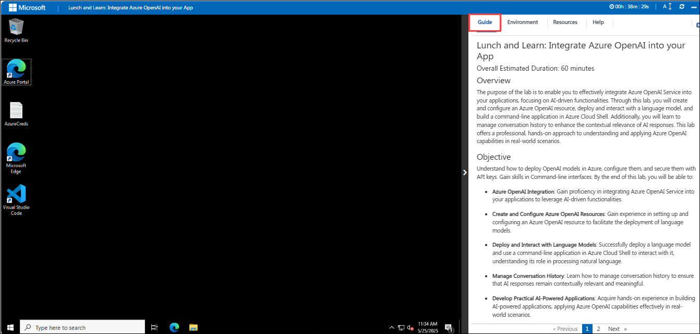
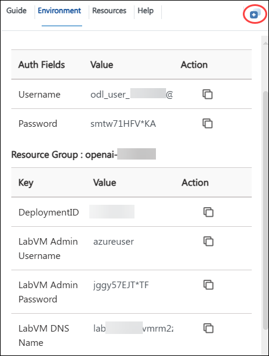
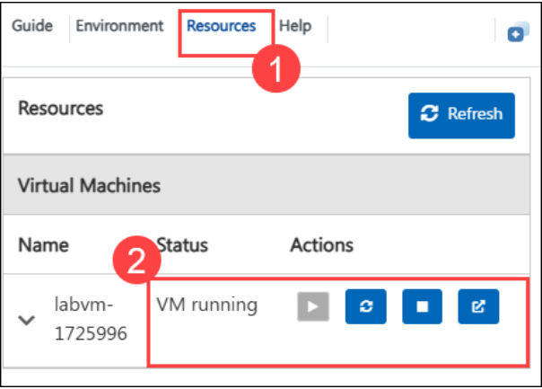
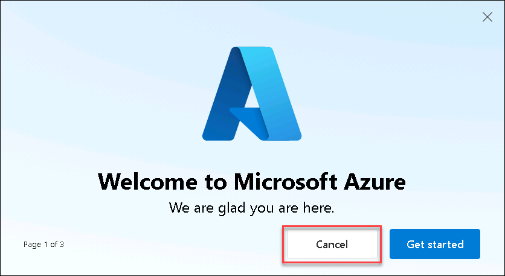
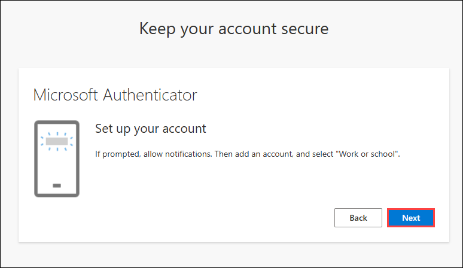
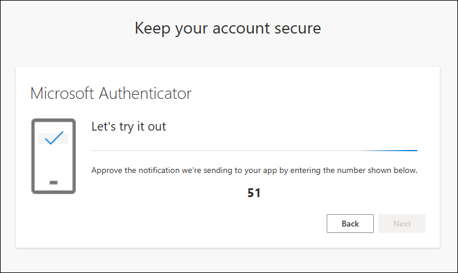
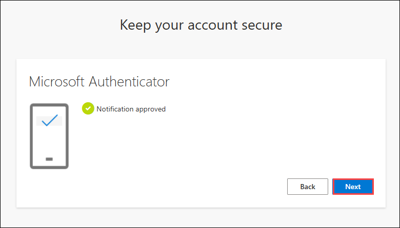

# Activate GenAI with Azure - Hackathon

### Overall Estimated Duration: 120 minutes

## Overview

This challenge focuses on deploying NVIDIA NeMo Inference Manager (NIM) containers on Azure Machine Learning (AML). NVIDIA NIM enables high-performance inference of LLMs using GPU-powered infrastructure, while Azure ML provides a scalable cloud platform to manage, deploy, and expose these models through online endpoints. The lab guides through API key generation, container registry setup, VS Code configuration, Docker integration, and complete deployment of a Llama-3.1-8B model using Azure tools..

## Objective

The primary objective of this challenge is to guide participants through the complete process of deploying a high-performance large language model using NVIDIA NeMo Inference Manager (NIM) on Azure. This includes setting up both the Azure and NVIDIA environments, configuring necessary tools, deploying the model container, and validating the deployed endpoint by running an inference test. The goal is to streamline AI model deployment for production use cases using Azure Machine Learning infrastructure and NVIDIA-optimized models.. By the end of this lab, you will be able to perform the below:

- Provision Azure and NVIDIA environments required for GPU-based model inference.

- Deploy the Llama-3.1-8B model using an NVIDIA NIM container hosted in Azure Container Registry.

- Expose and validate the model through an Azure Managed Online Endpoint by sending a test prompt and reviewing the output.

## Hackathon Format: Challenge-Based
This hackathon adopts a challenge-based format, offering you a unique opportunity to learn while dealing with practical problems. Each challenge includes one or more self-contained tasks designed to test and enhance your skills in specific aspects of AI app development. You will approach these challenges by:

Analyzing the problem statement.
Strategizing your approach to find the most effective solution.
Leveraging the provided lab environment and Azure AI services.
Collaborating with peers to refine and implement your solutions.

## Challenges
- Challenge 01: In this challenge, you’ll create an NVIDIA account to generate an API key and access NGC container images. They will then set up Azure resources and deploy the NIM container via Azure ML, exposing it through a managed online endpoint.
  
- Challenge 02: In this challenge, you’ll deploy an AI-powered chat app for Contoso Electronics using React and Python. It integrates Azure OpenAI Service with GPT-3.5 Turbo and Azure Cognitive Search for intelligent Q&A capabilities..

Each challenge comes with its own set of tasks and objectives. Feel free to explore the challenges, learn, and have fun during this hackathon! If you have any questions, don't hesitate to reach out to your coach.

Happy hacking! Feel free to explore the challenges, learn, and have fun during this hackathon! If you have any questions, don't hesitate to reach out to your coach.

Happy hacking!

## Prerequisites

- Before beginning the deployment process, users should have the following knowledge and tools in place to ensure a smooth experience:

- Azure Basics: Understanding of Azure concepts such as resource groups, Azure Machine Learning (AML) workspace, and online endpoints.

- Command-Line Proficiency: Familiarity with using Azure CLI, Git Bash, or terminal for running deployment scripts and managing resources.

- Container & Model Knowledge: Basic understanding of Docker containers, model inference concepts, and NVIDIA’s NeMo Inference Manager (NIM) or experience working with LLMs like LLaMA.

## Explanation of Components

The architecture for this lab involves the following key components:

- **NVIDIA Cloud Account Setup:** User creates a Build/NVAIE account and generates an NGC API Key.

- **Container Registry:** Azure Container Registry (ACR) is created to store the NIM container.

- **Configuration Setup:** Git Bash, VS Code, Docker, and Azure CLI are set up.

- **Custom NIM Container Creation:** NIM container is wrapped and pushed to ACR.

- **Azure ML Workspace:** A workspace is created to manage the deployment.

- **Endpoint Creation:** Azure ML exposes a REST endpoint to serve the model.

## Getting Started with the Lab

Once the environment is provisioned, a virtual machine (JumpVM) and lab guide will get loaded in your browser. Use this virtual machine throughout the workshop to perform the lab. You can see the number on the bottom of the lab guide to switch to different lab guide exercises.

## Accessing Your Lab Environment
 
Once you're ready to dive in, your virtual machine and **Guide** will be right at your fingertips within your web browser.
 
  

### Virtual Machine & Lab Guide
 
Your virtual machine is your workhorse throughout the workshop. The lab guide is your roadmap to success.

## Exploring Your Lab Resources
 
To get a better understanding of your lab resources and credentials, navigate to the **Environment** tab.
 
  
 
## Utilizing the Split Window Feature
 
For convenience, you can open the lab guide in a separate window by selecting the **Split Window** button from the top right corner.

  
 
## Managing Your Virtual Machine
 
From the **Resources (1)** tab feel free to **start, stop, or restart (2)** your virtual machine as needed . Your experience is in your hands!
 
  
 
## Lab Guide Zoom In/Zoom Out
 
To adjust the zoom level for the environment page, click the **A↕ : 100%** icon located next to the timer in the lab environment.

  

## Let's Get Started with Azure Portal
 
1. On your virtual machine, click on the **Azure Portal** icon as shown below:

   

2. You'll see the **Sign into Microsoft Azure** tab. Here, enter your credentials:
 
   - **Email/Username:** <inject key="AzureAdUserEmail"></inject>
 
    
 
3. Next, provide your password:
 
   - **Password:** <inject key="AzureAdUserPassword"></inject>
 
    
 
4. If prompted to stay signed in, you can click **No**.
 
5. If a **Welcome to Microsoft Azure** pop-up window appears, simply click **Cancel** to skip the tour.

   
   
 >**NOTE:** If you don't have the Microsoft Authenticator app installed on your mobile device, select **Download** now and follow the steps.

6. On the Set up your account page, select Next.

  

7. Scan the QR code with your phone. On the phone, inside the Authenticator app, select Work or school account, and scan the QR code.

  

8. On the Keep your account secure page. Enter the code, which is shown on the Authenticator app.

  

9. Once the code is entered. click Next

  

10. Select Done on the Success! page.

  

11. If you see the pop-up Stay Signed in?, click No.

12. If you see the pop-up You have free Azure Advisor recommendations!, close the window to continue the lab.

13. If a Welcome to Microsoft Azure popup window appears, click Cancel to skip the tour.
  

## Support Contact
 
The CloudLabs support team is available 24/7, 365 days a year, via email and live chat to ensure seamless assistance at any time. We offer dedicated support channels tailored specifically for both learners and instructors, ensuring that all your needs are promptly and efficiently addressed.

Learner Support Contacts:

- Email Support: Cloudlabs-support@spektrasystems.com

- Live Chat Support: https://cloudlabs.ai/labs-support

Now, click on **Next** from the lower right corner to move on to the next page.
 
    

### Happy Learning!!
